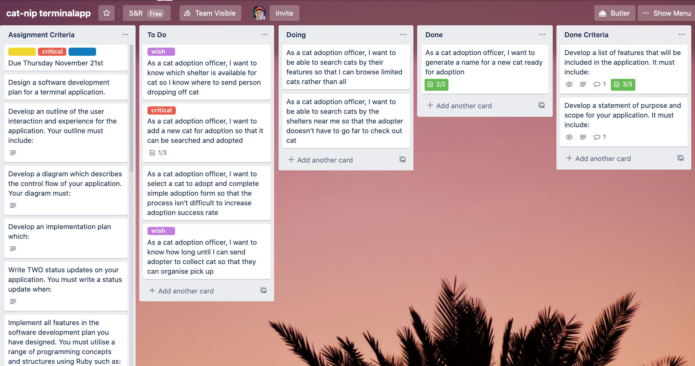
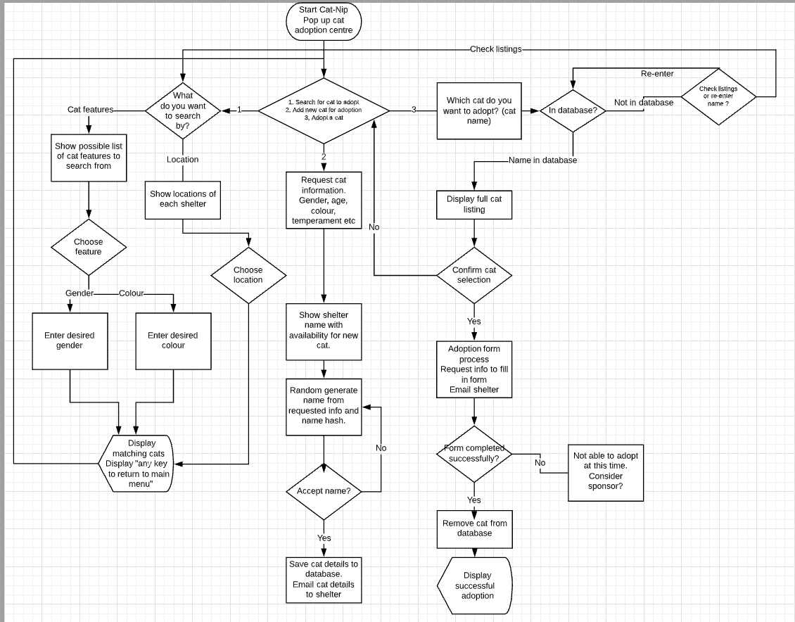

## Statement of Purpose ##
Cat-nip is a Terminal App to help rehome rescue cats in the Brisbane area. 

It connects all the nearby shelters to run the ultimate 'Pop-Up' cat rehoming booth!

**Problem to Solve:**

There are sadly many unwanted cats and amzingly several shelters and independent cat foster carers but there isn't a database connecting all the shelters to maximise the chance of adoption. The easier it is to discover the available cats in need, the better chance of rehoming.

This app will allow an operator in a pop up adoption centre to facilitate people to adopt a cat or drop off a cat for adoption. This will 

**Target Audience:**

Adoption shelters and independent cat foster care providers would be able to work together and streamline processes of cat adoption to maximise possibility of finding forever homes.

## Features ##

1. Search for a new purring fur baby by
    - location of the local shelters
    - desirable features for your kitty (for example, colour - ginger)
2. Apply to adopt your chosen bundle of joy
    - form created for your customer and sent to the shelter for approval
3. A stray cat can be added to the database and notifiction sent to a shelter that has room to look after cat where it will live until someone is ready to adopt the kitty baby

All these features make this 'Pop-Up' cat rehoming booth easy for the chief cat adoption officer to facilitate cat and kitten rehoming in the easiest way possible.

## Project Management ##

Trello board created with specific user stories to plan and prioritise tasks. The Kanban method was utilised on the Trello board with cards - containing checklists to complete.
This ensured the project remained on track and progress or lack of progress over specific time periods could be 

Stand up meetings were held twice. In future, especially when working in teams on separate branches, this method will be utilised more effectively.

## Original Concept Flow Chart ##

## Log of Progress ##

| Date       | Status Update                                 
|------------|------------------------------|
| 09/11/2019 | Brainstorm ideas and make git repository                                                                                                                                                                        
| 10/11/2019 | Make initial flowchart on lucidcharts. Make Trello Board with Assignment Criteria and User Stories. Send images of flowchart and Trello board to Naveen (techspert) for initial feedback/affirmation          
| 14/11/2019 | Write code for random name generator including choosing over 200 gender neutral cat names. Make Cat and Shelter classes. Install and run ruby gem 'artii'. Write code for main menu using until loop and case 
| 15/11/2019 | Change menu code to use ruby gem 'tty-prompt' to make menu easier to use and to decrease issues with user input (limits errors). Install ruby gem catpix and attempt to run - not working yet. Write code for search methods to search and display cats. Make changes to indentation to make code easier to read |   
| 16/11/2019 | Make the add cat for adoption method and link this to the cat name generator methods. Cat's having unique and fun names will make them more likely to be adopted. Still cannot get catpix to work
|18/11/2019 |  Create automatic adoption form that can be emailed to the appropriate cat shelter. Work on cat search functionality - Search by feature and search by location possible. Use ascii Pusheen instead of catpix.
| 20/11/2019 | Add 'tty-prompt' to the add cat for adoption method to minimise errors and make the process easier for the cat adoption officer running the app. Add persistence of shelters array. Remove catpix. Add bash script with bundle to make it easy to run the app.
-------------------------------------------------------------

## User interaction ##
After the Cat Adoption Officer who will be running the pop up cat adoption centre has followed the steps on the README to run the app, Catnip will disply the main menu. Titles and colours are used throughout the app to give the user (the Cat Adoption Officer) and enjoyable experience.

