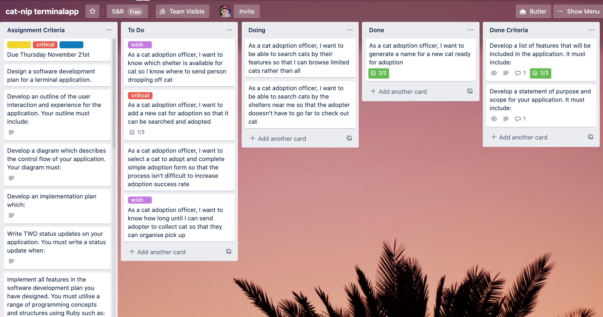
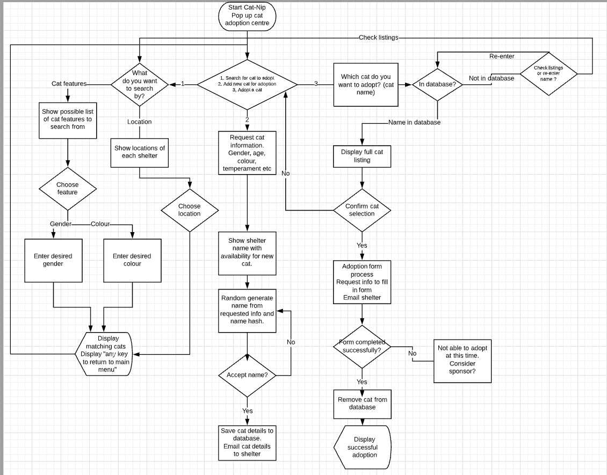

# Statement of Purpose 
Cat-nip is a Terminal App to help re-home rescue cats in the Brisbane area. 

It connects all the nearby shelters to run the ultimate 'Pop-Up' cat re-homing booth!

**Problem to Solve:**

There are sadly many unwanted cats and amazingly several shelters and independent cat foster carers but there isn't a database connecting all the shelters to maximise the chance of adoption. The easier it is to discover the available cats in need, the better chance of re-homing.

This app will allow an operator in a 'Pop-Up' adoption centre to facilitate people to adopt a cat or drop off a cat for adoption.

**Target Audience:**

Adoption shelters and independent cat foster care providers would be able to work together and streamline processes of cat adoption to maximise possibility of finding forever homes.

# Implementation Plan

## Project Management 

Trello board created with specific user stories to plan and prioritise tasks. The Kanban method was utilised on the Trello board with cards - containing checklists to complete.
This ensured the project remained on track and progress or lack of progress over specific time periods could be 

Stand up meetings were held twice. In future, especially when working in teams on separate branches, this method will be utilised more effectively.

## Original Concept Flow Chart 

## Log of Progress 

| Date       | Status Update                                 
|------------|------------------------------|
| 09/11/2019 | Brainstorm ideas and make git repository                                                                                                                                                                        
| 10/11/2019 | Make initial flowchart on lucidcharts.  Make Trello Board with Assignment Criteria and User Stories.  Send images of flowchart and Trello board to Naveen (techspert) for initial feedback/affirmation          
| 14/11/2019 | Write code for random name generator including choosing over 200 gender neutral cat names.  Make Cat and Shelter classes. Install and run ruby gem 'artii'.  Write code for main menu using until loop and case 
| 15/11/2019 | Change menu code to use ruby gem 'tty-prompt' to make menu easier to use and to decrease issues with user input (limits errors).  Install ruby gem catpix and attempt to run - not working yet. Write code for search methods to search and display cats.  Make changes to indentation to make code easier to read |   
| 16/11/2019 | Make the add cat for adoption method and link this to the cat name generator methods.  Cat's having unique and fun names will make them more likely to be adopted.  Still cannot get catpix to work
|18/11/2019 |  Create automatic adoption form that can be emailed to the appropriate cat shelter.  Work on cat search functionality - Search by feature and search by location possible.  Use ascii Pusheen instead of catpix.
| 20/11/2019 | Add 'tty-prompt' to the add cat for adoption method to minimise errors and make the process easier for the cat adoption officer running the app.  Add persistence of shelters array.  Remove catpix.  Add bash script with bundle to make it easy to run the app. Confirm with Glen (techspert) that documentation is following correct format.
-------------------------------------------------------------

## User Interaction 
After the Cat Adoption Officer who will be running the pop up cat adoption centre has followed the steps on the README to run the app, Catnip will display the main menu. Titles and colours are used throughout the app to give the user (the Cat Adoption Officer) and enjoyable experience.

### *Main Menu*

The main menu offers the Cat Adoption Officer the choice to: 
- Search for a kitty for a customer to adopt
- Add a new kitty that needs to be searchable so that it can be adopted (note: Cat Adoption Officer will need to notify customer to organise transport of kitty to the shelter that will look after it until adoption)
- Start the adoption process for a customer by using their licence to get some key information to send to the shelter (note: the shelter will make contact with customer to confirm adoption)
- Remove a kitty from the database when contacted by the shelter confirming that adoption was successful

### *Search for a Kitty*

When assisting a customer searching for available kitties to adopt there are two options:

*Search by location provides the shelters available and the location of the shelter so customer can browse all available cats at any one shelter.*

*Search by feature allows user to select multiple desirable features that they are looking for in their new kitty baby. Possible cat options are listed for you to provide to the customer. If cats are not displayed ask customers for any other desirable features to broaden search. If customer is set on a specific feature please tell them to keep popping by to search at another time as the cats often change over because this app is so effective!*

Kitties will be listed as follows:

### *Add Kitty for Adoption*
*When adding a new cat for adoption there are multiple features to be assigned for optimum searchability and hence adopt-ability. If a name doesn't already exist for a particular fur baby, a name generator can be used to provide quick and unique names for each new fur baby. The Cat Adoption Officer will then need to notify customer to organise transport of kitty to the shelter that will look after it until adoption.*

## Manual Testing

### Test Scenario 1: Cat Namer
**Related Requirements:**
As a cat adoption officer, I want to generate a name for a new cat ready for adoption

**Description:**
Testing the ability of Cat-Nip_App to generate a unique name to add to a cat description (new object) that is being put up for adoption. Cat Namer generates cat names up to a maximum of 7 words.
    
 
-----------------------------------------------------

#### Case 1: 3 words

**Steps:**
>1. Select 'Add kitty for adoption' option from main menu 
>2. Select options for each kitty feature   
>3. Type in n for no name already generated
>4. Enter "3" when prompted for number of words in the name

**Expected result:**
See a 3 word cat name printed. 

-----------------------------------------------------

**How I used this test during development:** 

*Hurrah! Cat name gives name. But...does not save to array - not persistent.*

**Changes made:** The `name_me_ow()` method (called in `add_cat(shelters)` ) needed to return the name as the variable `kitty_called` to create new cat. Code amended to create new cat using tty-prompt to manage possibility of incorrect user input. Add `shelters` array to a file to write to and look up to enable persistence of cats.

------------------------------------------------------------------       
#### Case 2: 1 word
>Steps:
>1. Select 'Add kitty for adoption' option from main menu 
>2. Select options for each kitty feature   
>3. Type in no input for word to include in cat name
>4. Enter "1" when prompted for number of words in the name

**Expected result:**
See a 1 word cat name printed. 

----------------------------------------------

**How I used this test during development:** 
*Oh no! Cat name returned as blank and saved. But...we can't have a nameless cat.*

**Changes made:** Needed to add if statement to `name_me_ow()` method so that there is at least 1 word in name and no more than 7 names. (7 seems reasonable for a very fancy kitty!)
(Now fixed - actual result is expected result)

----------------------------------------------
#### Case 3: 17 words (bad input)
>Steps:
>1. Select 'Add kitty for adoption' option from main menu 
>2. Select options for each kitty feature   
>3. Type in any word input for word to include in cat name
>4. Enter "17" when prompted for number of words in the name

**Expected result:**
A 2 word cat name is printed. 

----------------------------------------------

**How I used this test during development:** 
*Oh no! Cat name returned as blank and saved. But...we can't have a nameless cat.*

*Yayayayayay Cat name returned as default 2 names!*

----------------------------------------------

### Scenario: Search by Cat Feature

**Related Requirements:**
As a cat adoption officer, I want to be able to search cats by their features so that I can browse limited cats rather than all cats in the database

**Description:**
Testing the ability of Cat-Nip_App to search for cats in the database based on multiple selected

----------------------------------------------

#### Case 1: search by multiple features
**Steps:**
>1. Select 'Search for a kitty to adopt' option from main menu 
>2. Select 'Search by feature' option from kitty searching menu
>3. Use the arrow keys to move through possible choices and select features using the space bar
>4. Once all selections of desirable features are made, hit enter to continue

**Expected result:**

Cat listings matching any of the desirable features show as a list

----------------------------------------------
**How I used this test during development:** 

Yayayayay! Search by cat feature works as expected, producing list of cats with any of the selected desirable feature

------------------------------------------------------------------       

#### Case 2: search by one uncommon feature

**Steps:**
>1. Select 'Search for a kitty to adopt' option from main menu 
>2. Select 'Search by feature' option from kitty searching menu
>3. Use the arrow keys to move through possible choices and select only one feature using the space bar
>4. Hit enter to continue

**Expected result:**

As there are no cat listings matching this one desirable features, no cats are displayed. 

-----------------------------------------------------
**How I used this test during development:** 

This test still fails.

This should not be very common given the number of cats available for re-homing. It is not a priority to fix, however, in the future extra functionality can be added to advise that no cats currently match desired features but they could leave details to be notified when a kitty matching becomes available.

------------------------------------------------------------------  

# The Future of Cat-Nip_TerminalApp

Once funding is established for the committed crew of techies at Cat-Nip the following features could be added:
- Adoption forms can be emailed automatically to cat shelters.
- Each shelter's cat housing capacity can be stored so we know when shelters are at capacity, and can avoid sending cats to them that would be turned away.
- An appointment booking feature can be added so that people can go and visit cats before confirming adoption.
- An approval step for adoption can be integrated into the app and then customers can be notified when their application for adoption is approved.

